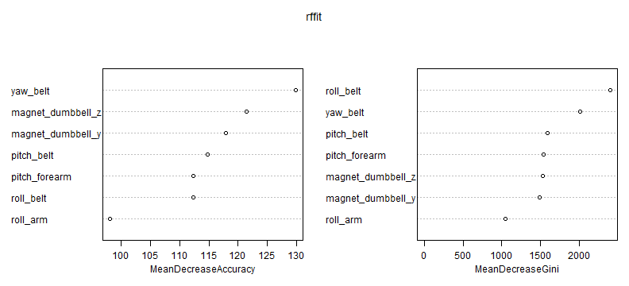

# Judging Exercise Correctness from Accelerator Data

Practical Machine Learning - Course Project Write-up

Mike Wise - 25 Aug 2014 - predmachlearn-004

# Background

Using devices such as Jawbone Up, Nike Fuel Band, and Fitbit it is now possible to collect a large amount of data about personal activity relatively inexpensively. These type of devices are part of the quantified self movement - a group of enthusiasts who take measurements about themselves regularly to improve their health, to find patterns in their behavior, or because they are tech geeks. One thing that people regularly do is quantify how much of a particular activity they do, but they rarely quantify the quality - i.e.how well they do it. The goal here is to use data from accelerometers on the belt, forearm, arm, and dumbbell to assess the quality. 

In this exercise 6 young health participants were asked to perform one set of 10 repetitions of the Unilateral Dumbbell Biceps Curl. The quality of the execution was judged by an expert and fell into 5 different classes or grades:

- Class A - correct - exactly according to the specification
- Class B - mistake - throwing the elbows to the front
- Class C - mistake - lifting the dumbbell only halfway
- Class D - mistake - lowering the dumbbell only halfway
- Class E - mistake - throwing the hips to the front

At the same time these exercises were being performed data was being recorded from a large number of sensors mounted on the body of the exercise participant. There are 19622 observations in our data training set, the goal here is to see if this judging can be can automate.

More information is available from the website here (see the section on the Weight Lifting Exercise Dataset):

             http://groupware.les.inf.puc-rio.br/har 
 
# Overall Approach
Our data came in two spreadsheet files:
- pml-training.csv - a csv file containing 19622 observations with 160 columns with labeled training data.
- pml-training.csv - a csv file containing 20 observations that are to be predicted with our final model and submitted. This data is only to be used in the last step of this project as it is unlabled and thus cannot be used for training.

We loaded the data and after some basic cleaning (limiting our data to the numeric or integer columns that had complete data - there were 17 of these) we did some exploratory analysis. We discovered:
- the randomForest in the randomForest package executed quite quickly on our data
- Both the boosting tree and the random forest that are called in the caret package were painfully slow - although probably more sophisticated.

This led us to concentrate on the randomForest package implementation since we can try out more in this learning environment.

We then investigated the trade offs between accuracy and validation set size, as well as how these change with the number of variables. In the end we chose to go with the model using all
17 variables since it had the best accuracy and the performance was acceptable. The trade off can be seen below, we chose to go with 75% of the data with a corresponding accuracy of close to 977%.


```r
dfva <- read.csv("dftestAv-3it.csv")
dfva$varnum <- "All vars"

dfv3 <- read.csv("dftest3v-3it.csv")
```

```
## Error: first five rows are empty: giving up
```

```r
dfv3$varnum <- "3 vars"

dfv6 <- read.csv("dftest6v-3it.csv")
dfv6$varnum <- "6 vars"

dfall <- merge(dfva,dfv3,all=T)
dfall <- merge(dfall,dfv6,all=T)

qplot(prob,acc,data=dfall) + geom_smooth(method=loess) + 
  facet_grid( . ~ varnum ) +
  ggtitle("Accuracy vs. Training Percentage") +
  labs(x="Training Percentage",y="Accuracy")
```

 

# Data Processing
## Loading and preprocessing the data
Here we link in some libraries will will be using in the following code, we presume the directory
has already been set to contain the data.
We then load the data (as a data.table as opposed to a data.frame 
for faster and more flexible manipulation)


```r
library(data.table)
library(ElemStatLearn)
library(randomForest)
library(caret)
library(ggplot2)

# Data Processing
## Load the data

otrn <- data.table(read.csv("pml-training.csv"))
otst <- data.table(read.csv("pml-testing.csv"))
```

# Data Exploration
There are 19622 observations of 160 columns in our dataset. Here we look at the distribution of grades by participant

```r
ggplot(otrn,aes(x=classe))+geom_histogram(fill=c("darkgreen","darkred","darkred","darkred","darkred")) +
   ggtitle("Participants and Exercise Grade") + facet_grid( . ~ user_name ) +
   labs(x="Grade/Class",y="Count")
```

 

# Data Cleaning
There are 160 columns in the original data, many of them blank and filled with NA values. We reduce the dataset, throwing
away all columns that are not numeric or integer. We also throw away the column "num_window" and "user_name" out of the 
training set as these are not sensor data columns.
Here we take a look at the participants and the judged quality of their exercises.


```r
## Get rid of all non-numeric columns not present in both datasets
cnstst <- colnames(otrn)[7:59]
lntrn <- length(otrn)
lntst <- length(otst)

ntrn <- data.table(user_name=otrn[["user_name"]],classe=otrn[["classe"]])
ntst <- data.table(user_name=otst[["user_name"]])

for (i in 1:length(cnstst))
{
  cn <- cnstst[[i]]
  if (cn=="num_window") next
  if (cn=="user_window") next
  clstst <- class(otst[[cn]])
  clstrn <- class(otrn[[cn]])
  if (clstst!="numeric" && clstst !="integer") next
  if (clstrn!="numeric" && clstrn !="integer") next
  ntrn[[cn]] <- otrn[[cn]]
  ntst[[cn]] <- otst[[cn]]
}
```

Here we check the quality of the data, showing what columns we have retained (all relevant sensor data columns) and 
showing that we have reduced the number of "NA" values from 1.2 million to zero, mostly by eliminating columns that consisted mostly of "NA" values.


```r
# Check the quality
hdat <- melt(ntrn)
ggplot(hdat,aes(x = value)) + facet_wrap(~variable,scales = "free_x",ncol=6) + geom_histogram()
```

 


```r
ona <- sum(is.na(otrn))
nna <- sum(is.na(ntrn))
msg <- sprintf("Original training na count:%d  - After processing:%d",ona,nna)
print(msg)
```

```
## [1] "Original training na count:1287472  - After processing:0"
```

# Train and Validation Splits
There was some debate in the discussion forums as to whether or not data should be split into testing and validation sets should be used with a randomForest approach. 

The arguments against were:
- randomForest is not prone to overfitting, thus the more data the better
- internally a splitting of the data into validation and testing sets is done anyway when computing the weights.

However there are also good arguments to do a validation, namely:
- since this is a training exercise it is good to demonstrate that we can do it.
- in a real world consulting situation the customer will probably want to see this.
- most interestingly, our data above shows that the limiting accuracy is not 100 percent, rather something less than 98 percent.

The following code performs this split.


```r
      ntrn0 <- ntrn
      trnidx <- createDataPartition(y=ntrn0$classe,p=0.75,list=F)
      ntrndf <- data.frame(ntrn0)
      nvld <- ntrndf[-trnidx,]
      ntrn <- ntrndf[trnidx,]
```

# Model Fitting

We fit a model to the data using the "Random Forests" algorithm from the random Forest library. We then evaluate the importance of the
various variable and assess the overall accuracy of the model using the Confusion Matrix.

As can be seen from the Confusion Matrix below, the model accuracy on the training data set is 100%, however the accuracy on the validation set is somewhat less (see below)

Here we fit the model after setting the random number seed so that we can reproduce our results.

```r
set.seed(2718)
rffit <- randomForest(classe ~ ., ntrn, importance=T)
```

Now we check the results against the training set, not surprisingly it is 100 percent correct.

```r
prftrn <- predict(rffit, ntrn)
confusionMatrix(prftrn, ntrn$classe)
```

```
## Confusion Matrix and Statistics
## 
##           Reference
## Prediction    A    B    C    D    E
##          A 4185    0    0    0    0
##          B    0 2848    0    0    0
##          C    0    0 2567    0    0
##          D    0    0    0 2412    0
##          E    0    0    0    0 2706
## 
## Overall Statistics
##                                 
##                Accuracy : 1     
##                  95% CI : (1, 1)
##     No Information Rate : 0.284 
##     P-Value [Acc > NIR] : <2e-16
##                                 
##                   Kappa : 1     
##  Mcnemar's Test P-Value : NA    
## 
## Statistics by Class:
## 
##                      Class: A Class: B Class: C Class: D Class: E
## Sensitivity             1.000    1.000    1.000    1.000    1.000
## Specificity             1.000    1.000    1.000    1.000    1.000
## Pos Pred Value          1.000    1.000    1.000    1.000    1.000
## Neg Pred Value          1.000    1.000    1.000    1.000    1.000
## Prevalence              0.284    0.194    0.174    0.164    0.184
## Detection Rate          0.284    0.194    0.174    0.164    0.184
## Detection Prevalence    0.284    0.194    0.174    0.164    0.184
## Balanced Accuracy       1.000    1.000    1.000    1.000    1.000
```

Now we check the results against our validation set which is 25% of our original data. The accuracy is 96.7% implying an out-of-sample error of 3.3%.

```r
prfvld <- predict(rffit, nvld)
confusionMatrix(prfvld, nvld$classe)
```

```
## Confusion Matrix and Statistics
## 
##           Reference
## Prediction    A    B    C    D    E
##          A 1349   10   16    4    2
##          B   23  926   19    2    1
##          C    8   10  807    9    2
##          D   13    2   12  788    0
##          E    2    1    1    1  896
## 
## Overall Statistics
##                                         
##                Accuracy : 0.972         
##                  95% CI : (0.967, 0.976)
##     No Information Rate : 0.284         
##     P-Value [Acc > NIR] : <2e-16        
##                                         
##                   Kappa : 0.964         
##  Mcnemar's Test P-Value : 0.072         
## 
## Statistics by Class:
## 
##                      Class: A Class: B Class: C Class: D Class: E
## Sensitivity             0.967    0.976    0.944    0.980    0.994
## Specificity             0.991    0.989    0.993    0.993    0.999
## Pos Pred Value          0.977    0.954    0.965    0.967    0.994
## Neg Pred Value          0.987    0.994    0.988    0.996    0.999
## Prevalence              0.284    0.194    0.174    0.164    0.184
## Detection Rate          0.275    0.189    0.165    0.161    0.183
## Detection Prevalence    0.282    0.198    0.170    0.166    0.184
## Balanced Accuracy       0.979    0.982    0.968    0.987    0.997
```
Here we look at the variables in their order of importance. We used this ranking to try our 3 and 6 variable subset models above.

```r
varImpPlot(rffit)
```

 
And finally for completeness sake, we use the model we generated to predict the values needed on the submission entry for this project. 

```r
prftst <- predict(rffit, ntst)
prftst
```

```
##  1  2  3  4  5  6  7  8  9 10 11 12 13 14 15 16 17 18 19 20 
##  B  A  B  A  A  E  D  B  A  A  B  C  B  A  E  E  A  B  B  B 
## Levels: A B C D E
```

# Appendix A - Tradeoff curve code

The following code was used to generate the trade off curves of validation set size vs. accuracy that were used in this analysis to help determine the variables that we fitted and the size of the validation set.


```r
library(data.table)
library(ElemStatLearn)
library(randomForest)
library(caret)

# Data Processing
## Load the data

otrn <- data.table(read.csv("pml-training.csv"))
otst <- data.table(read.csv("pml-testing.csv"))

## Get rid of all non-numeric columns not present in both datasets
cnstst <- colnames(otrn)[7:59]
lntrn <- length(otrn)
lntst <- length(otst)

ntrn <- data.table(user_name=otrn[["user_name"]],classe=otrn[["classe"]])
ntst <- data.table(user_name=otst[["user_name"]])

for (i in 1:length(cnstst))
{
  cn <- cnstst[[i]]
  if (cn=="num_window") next
 # if (cn=="user_name") next
  clstst <- class(otst[[cn]])
  clstrn <- class(otrn[[cn]])
  if (clstst!="numeric" && clstst !="integer") next
  if (clstrn!="numeric" && clstrn !="integer") next
  ntrn[[cn]] <- otrn[[cn]]
  ntst[[cn]] <- otst[[cn]]
}

# Check the quality

ona <- sum(is.na(otrn))
nna <- sum(is.na(ntrn))
msg <- sprintf("Original training na count:%d  - After processing:%d",ona,nna)
print(msg)
ntrn0 <- ntrn

# Iterate
baseprobseq <- seq( 0.05, 0.95, variable0.05 )
#baseprobseq <- seq( 0.1, 0.9, 0.2 )
nsamp <- 3

pvec <- c()
avec <- c()
tvec <- c()
evec <- c()

for (i in 1:20)
{
  vcmd <- sprintf("v%d = c()",i)
  eval(parse(text=vcmd))
}

ntodo <- length(baseprobseq)*nsamp
idone <- 0
iprobdone <- 0
eta <- 0
acc <- 0
sttime <- proc.time()
for (prob in baseprobseq)
{
   for (j in 1:nsamp)
   {
      jsttime <- proc.time()
      celap <- (jsttime-sttime)["elapsed"]
      if (idone>0)
      {
          eta <- ntodo*celap/idone
      }
      msg <- sprintf("it:%d/%d prob:%5.2f last-acc:%5.3f elap:%6.1f eta-sec:%6.1f",idone,ntodo,prob,acc,celap,eta)
     # msg <- sprintf("it:%d/%d prob:%5.2f",idone,ntodo,prob)
      print(msg)

      trnidx <- createDataPartition(y=ntrn0$classe,p=prob,list=F)
      ntrndf <- data.frame(ntrn0)
      nvld <- ntrndf[-trnidx,]
      ntrn <- ntrndf[trnidx,]

      #rffit <- randomForest(classe ~ ., ntrn, importance=T)
      rffit <- randomForest(classe ~ yaw_belt + pitch_belt + roll_belt, ntrn, importance=T)
      #rffit <- randomForest(classe ~ yaw_belt + pitch_belt + roll_belt + roll_arm + total_accel_arm + yaw_arm, ntrn, importance=T)
     
      prfvld <- predict(rffit, nvld)
      cm <- confusionMatrix(prfvld, nvld$classe)
      acc <- cm$overall["Accuracy"]
      pvec <- c(pvec,prob)
      avec <- c(avec,acc)
      prftst <- predict(rffit, ntst)
      for (i in 1:20)
      {
        vcmd1 <- sprintf("vtmp = as.character(prftst[[%d]])",i)
        eval(parse(text=vcmd1))
        vcmd2 <- sprintf("v%d = c(v%d,vtmp)",i,i) 
        eval(parse(text=vcmd2))
      }
      elap <- proc.time() - jsttime
      evec <- c(evec,elap["elapsed"])
 
      plot(pvec,avec)

      idone <- idone+1
   }
   iprobdone <- iprobdone+1
}
qplot(pvec,avec) + geom_smooth()

df <- data.frame(prob=pvec,acc=avec,elap=evec)
for (i in 1:20)
{
  vcmd3 <- sprintf("df$v%d <- v%d",i,i)
  eval(parse(text=vcmd3))
}
write.csv(df,"dftest3v-3it.csv")
```
