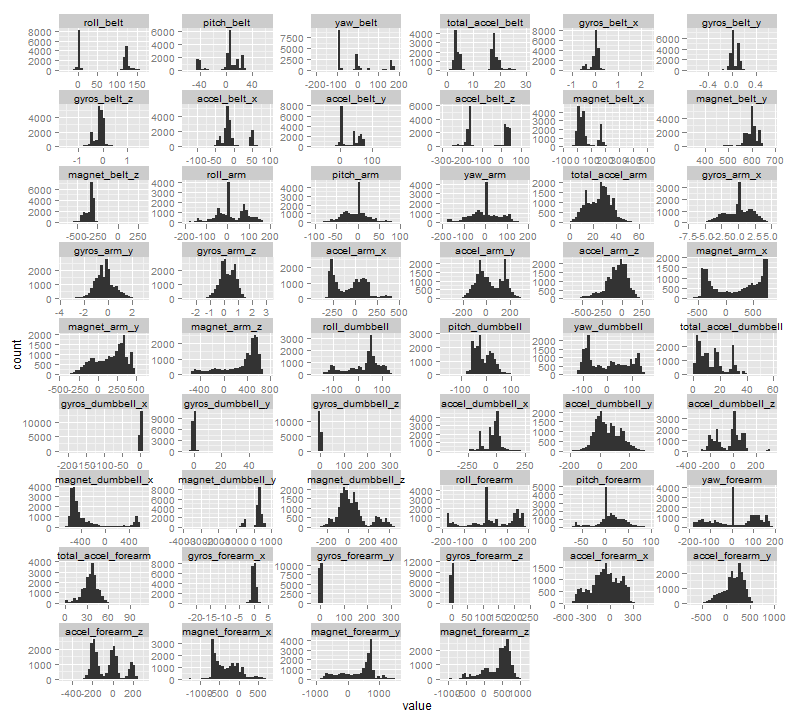

# Judging Exercise Correctness from Accelerator Data

Practical Machine Learning - Course Project Write-up

Mike Wise - 25 Aug 2014 - predmachlearn-004

# Background

Using devices such as Jawbone Up, Nike Fuel Band, and Fitbit it is now possible to collect a large amount of data about personal activity relatively inexpensively. These type of devices are part of the quantified self movement - a group of enthusiasts who take measurements about themselves regularly to improve their health, to find patterns in their behavior, or because they are tech geeks. One thing that people regularly do is quantify how much of a particular activity they do, but they rarely quantify the quality - i.e.how well they do it. The goal here is to use data from accelerometers on the belt, forearm, arm, and dumbbell to assess the quality. 

In this exercise 6 young health participants were asked to perform one set of 10 repetitions of the Unilateral Dumbbell Biceps Curl. The quality of the execution was judged by an expert and fell into 5 different classes or grades:

- Class A - correct - exactly according to the specification
- Class B - mistake - throwing the elbows to the front
- Class C - mistake - lifting the dumbbell only halfway
- Class D - mistake - lowering the dumbbell only halfway
- Class E - mistake - throwing the hips to the front

At the same time these exercises were being performed data was being recorded from a large number of sensors mounted on the body of the exercise participant. There are 19622 observations in our data training set, the goal here is to see if this judging can be can automate.

More information is available from the website here (see the section on the Weight Lifting Exercise Dataset):

             http://groupware.les.inf.puc-rio.br/har 
 
# Overall Approach
 
The overall approach was as follow:
- 1. **Data Preperation** - here the training and test data was read and new datasets were created containing only numeric columns that were appropriate for modeling.
- 2. **Data Exploration and Model Selection** - here the data was investigated, and an investigation of the trade off between accuracy and training/validation split size was performed for various combinations of modeling techniques and variable subsets.
- 3. **Modeling and Analysis** - In this section the split was performed and selected model was run and an analysis of the results was performed. The Out of sample error is also calculated.
- 4. **Prediction** - Here the results for the Prediction Assignment Submission are calculated.

Some additional code is also presented in the Appendix.

# Data Preperation

Our data came in two spreadsheet files:
- **pml-training.csv** - a csv file containing 19622 observations with 160 columns with labeled training data. This data is to be used to train and validate our model.
- **pml-training.csv** - a csv file containing 20 observations with the same columns (but minus the label). This data is t be predicted with our final model and submitted. it is only used in the last step of this project.

## Loading and preprocessing the data
First of course we load the data.


```r
library(data.table,quietly=T)

otrn <- data.table(read.csv("pml-training.csv"))
otst <- data.table(read.csv("pml-testing.csv"))
```


## Data Cleaning
There are 160 columns in the original data, many of them blank and filled with NA values. We reduce the dataset, throwing away all columns that are not numeric or integer. We also exclude the columns "num_window" and "user_name" out of the training set as these are not sensor data columns.


```r
## Create new tables without of all non-numeric columns not present in both datasets
cnstst <- colnames(otrn)[7:160]
ntrn <- data.table(user_name=otrn[["user_name"]],classe=otrn[["classe"]])
ntst <- data.table(user_name=otst[["user_name"]])

for (i in 1:length(cnstst))
{
  cn <- cnstst[[i]]
  if (cn=="num_window") next
  if (cn=="user_window") next
  clstst <- class(otst[[cn]])
  clstrn <- class(otrn[[cn]])
  if (clstst!="numeric" && clstst !="integer") next
  if (clstrn!="numeric" && clstrn !="integer") next
  ntrn[[cn]] <- otrn[[cn]]
  ntst[[cn]] <- otst[[cn]]
}
```

Here the quality of the data is checked, showing what columns we have retained (all relevant sensor data columns) and showing the reduction in  the number of "NA" values from 1.2 million to zero, mostly by eliminating columns that consisted mostly of "NA" values.


```r
ona <- sum(is.na(otrn))
nna <- sum(is.na(ntrn))
print(sprintf("Original training NA count:%d  - After processing:%d",ona,nna))
```

```
## [1] "Original training NA count:1287472  - After processing:0"
```

## Data Exploration
Now that we have a more acceptable number of data columns (54 vs. 160) we look at the overall data.


```r
library(reshape)
library(ggplot2,quietly=T)

hdat <- melt(ntrn)
ggplot(hdat, aes(x=value)) + facet_wrap(~variable, scales="free",ncol=6) + geom_histogram()
```

 
There are 19622 observations of 160 columns in our dataset. Here we look at the distribution of grades by participant.


```r
ggplot(otrn,aes(x=classe))+geom_histogram(fill=c("darkgreen","darkred","darkred","darkred","darkred")) +
   ggtitle("Participants and Exercise Grade") + facet_grid( . ~ user_name ) +
   labs(x="Grade/Class",y="Count")
```

 


## Model Selection
We discovered:
- the randomForest in the randomForest package executed quite quickly on our data
- Both the boosting tree and the random forest that are called in the caret package were painfully slow - although probably more sophisticated.

This led us to concentrate on the randomForest package implementation since we can try out more in this learning environment.

We then investigated the trade offs between accuracy and validation set size, as well as how these change with the number of variables. 

First we selected a set of the most 3 important and then the most 7 important variables. We did this by doing a random forest on the training
set using all the variables. 


```r
library(ElemStatLearn,quietly=T)
library(randomForest,quietly=T)
library(caret,quietly=T)

set.seed(2718)
rffit1 <- randomForest(classe ~ ., ntrn, importance=T)

varImpPlot(rffit1)
```

 

The variables we selected were:
- 1. yaw_belt
- 2. roll_belt
- 3. pitch_belt
- 4. roll_arm
- 5. pitch_forearm
- 6. magnet_dumbbell_y
- 7. magnet_dumbbell_z


To investigate the trade offs we executed a large number of randomForest calls with different sizes of training/validation set splits, different number of variables, and recorded the accuracy on each run. 
Specifically:
 - we varied the randomForest calls for 3 variable, 7 variable, and 54 variable subsets.
 - varied the training/validation set split from 0.05% to 0.95% in 0.05% steps
 - we ran the resulting randomForest fit against the validation set and recorded the accuracy.
The code for this can be found in the appendix.

This was done with 3 runs (one per variable subset) which contained 57 calls to randomForest each.

The results of the trade-off analysis can be seen here:


```r
dfva <- read.csv("dftest54v-3it.csv")
dfva$varnum <- "54 vars"

dfv7 <- read.csv("dftest7v-3it.csv")
dfv7$varnum <- "7 vars"

dfv3 <- read.csv("dftest3v-3it.csv")
dfv3$varnum <- "3 vars"

dfall <- merge(dfv3,dfv7,all=T)
dfall <- merge(dfall,dfva,all=T)
dfall <- transform(dfall, varnum=factor(varnum,levels=c("3 vars","7 vars","54 vars") ))

qplot(prob,acc,data=dfall) + geom_smooth(method=loess) + facet_grid( . ~ varnum ) +
  ggtitle("Accuracy vs. Training Percentage") + labs(x="Training Percentage",y="Accuracy")
```

 

The time to create these datasets was as follows (see appendix and datasets for more details):
 -  3 var subset - dftest3v-3it.csv  - 57 rf-calls in  304.22 secs ( 5.3 secs per iteration)
 -  7 var subset - dftest7v-3it.csv  - 57 rf-calls in  429.98 secs ( 7.7 secs per iteration)
 - 54 var subset - dftest54v-3it.csv - 57 rf-calls in 2668.50 secs (46.8 secs per iteration)

In the end we chose to go with the model using 7 variables and a 75% training/validation split since it: 
-  Had very good accuracy.
-  Had performance much better than the 54 variable set. 

From these plots **we expect the out of sample error to be around 98.8% for 7 vars amd 75% split.**

# Model and Analysis

## Train and Validation Splits
There was some debate in the discussion forums as to whether or not data should be split into testing and validation sets should be used with a randomForest approach. 

The arguments against were:
- randomForest is not prone to overfitting, thus the more data the better
- internally a splitting of the data into validation and testing sets is done anyway when computing the weights.

However there are also good arguments to do a validation, namely:
- since this is a training exercise it is good to demonstrate that we can do it.
- in a real world consulting situation the customer will probably want to see this.
- most interestingly, our data above shows that the limiting accuracy is not 100 percent, rather something less than 98 percent.

The following code performs this split.


```r
      set.seed(3141)
      ntrn0 <- ntrn
      trnidx <- createDataPartition(y=ntrn0$classe,p=0.75,list=F)
      ntrndf <- data.frame(ntrn0)
      nvld <- ntrndf[-trnidx,]
      ntrn <- ntrndf[trnidx,]
      print(sprintf("Validation set has %d and training set has %d rows",nrow(nvld),nrow(ntrn)))
```

```
## [1] "Validation set has 4904 and training set has 14718 rows"
```

## Model Fitting
We fit a model to the data using the "Random Forests" algorithm from the random Forest library. We then evaluate the importance of the
various variable and assess the overall accuracy of the model using the Confusion Matrix.

As can be seen from the Confusion Matrix below, the model accuracy on the training data set is 100%, however the accuracy on the validation set is somewhat less (see below)

Here we fit the model after setting the random number seed so that we can reproduce our results.

```r
set.seed(2718)
rffit <- randomForest(classe ~ yaw_belt + pitch_belt + roll_belt + roll_arm + pitch_forearm + 
                        magnet_dumbbell_y + magnet_dumbbell_z, ntrn, importance=T)
```

## Validation Analysis
Now we check the results against the training set, not surprisingly it is 100 percent correct.

```r
prftrn <- predict(rffit, ntrn)
confusionMatrix(prftrn, ntrn$classe)
```

```
## Confusion Matrix and Statistics
## 
##           Reference
## Prediction    A    B    C    D    E
##          A 4185    0    0    0    0
##          B    0 2848    0    0    0
##          C    0    0 2567    0    0
##          D    0    0    0 2412    0
##          E    0    0    0    0 2706
## 
## Overall Statistics
##                                 
##                Accuracy : 1     
##                  95% CI : (1, 1)
##     No Information Rate : 0.284 
##     P-Value [Acc > NIR] : <2e-16
##                                 
##                   Kappa : 1     
##  Mcnemar's Test P-Value : NA    
## 
## Statistics by Class:
## 
##                      Class: A Class: B Class: C Class: D Class: E
## Sensitivity             1.000    1.000    1.000    1.000    1.000
## Specificity             1.000    1.000    1.000    1.000    1.000
## Pos Pred Value          1.000    1.000    1.000    1.000    1.000
## Neg Pred Value          1.000    1.000    1.000    1.000    1.000
## Prevalence              0.284    0.194    0.174    0.164    0.184
## Detection Rate          0.284    0.194    0.174    0.164    0.184
## Detection Prevalence    0.284    0.194    0.174    0.164    0.184
## Balanced Accuracy       1.000    1.000    1.000    1.000    1.000
```

Now we check the results against our validation set which is 25% of our original data. There are 7+15+7+2+10+3+4+3+2+1+5 = 59 incorrect classifications out of 1388+922+845+798+892+59 = 4904 cases implying an accuracy of %98.797. Thus we have an an **out-of-sample error of 1.203%**.

```r
prfvld <- predict(rffit, nvld)
confusionMatrix(prfvld, nvld$classe)
```

```
## Confusion Matrix and Statistics
## 
##           Reference
## Prediction    A    B    C    D    E
##          A 1388   10    0    0    0
##          B    7  922    3    2    5
##          C    0   15  845    4    1
##          D    0    2    7  798    3
##          E    0    0    0    0  892
## 
## Overall Statistics
##                                         
##                Accuracy : 0.988         
##                  95% CI : (0.985, 0.991)
##     No Information Rate : 0.284         
##     P-Value [Acc > NIR] : <2e-16        
##                                         
##                   Kappa : 0.985         
##  Mcnemar's Test P-Value : NA            
## 
## Statistics by Class:
## 
##                      Class: A Class: B Class: C Class: D Class: E
## Sensitivity             0.995    0.972    0.988    0.993    0.990
## Specificity             0.997    0.996    0.995    0.997    1.000
## Pos Pred Value          0.993    0.982    0.977    0.985    1.000
## Neg Pred Value          0.998    0.993    0.998    0.999    0.998
## Prevalence              0.284    0.194    0.174    0.164    0.184
## Detection Rate          0.283    0.188    0.172    0.163    0.182
## Detection Prevalence    0.285    0.191    0.176    0.165    0.182
## Balanced Accuracy       0.996    0.984    0.992    0.995    0.995
```


# Prediction

And finally for completeness sake, we use the model we generated to predict the values needed on the submission entry for this project. 

```r
prftst <- predict(rffit, ntst)
prftst
```

```
##  1  2  3  4  5  6  7  8  9 10 11 12 13 14 15 16 17 18 19 20 
##  B  A  B  A  A  E  D  B  A  A  B  C  B  A  E  E  A  B  B  B 
## Levels: A B C D E
```

# Appendix A - Tradeoff curve code

The following code was used to generate the trade off curves of validation set size vs. accuracy that were used in this analysis to help determine the variables that we fitted and the size of the validation set.


```r
library(data.table)
library(ElemStatLearn)
library(randomForest)
library(caret)

# Data Processing
## Load the data

otrn <- data.table(read.csv("pml-training.csv"))
otst <- data.table(read.csv("pml-testing.csv"))

## Create new tables without of all non-numeric columns not present in both datasets
cnstst <- colnames(otrn)[7:160]
ntrn <- data.table(user_name=otrn[["user_name"]],classe=otrn[["classe"]])
ntst <- data.table(user_name=otst[["user_name"]])

for (i in 1:length(cnstst))
{
  cn <- cnstst[[i]]
  if (cn=="num_window") next
 # if (cn=="user_name") next
  clstst <- class(otst[[cn]])
  clstrn <- class(otrn[[cn]])
  if (clstst!="numeric" && clstst !="integer") next
  if (clstrn!="numeric" && clstrn !="integer") next
  ntrn[[cn]] <- otrn[[cn]]
  ntst[[cn]] <- otst[[cn]]
}

# Check the quality

ona <- sum(is.na(otrn))
nna <- sum(is.na(ntrn))
msg <- sprintf("Original training na count:%d  - After processing:%d",ona,nna)
print(msg)
ntrn0 <- ntrn

# Iterate
baseprobseq <- seq( 0.05, 0.95, 0.05 )
#baseprobseq <- seq( 0.1, 0.9, 0.2 )
nsamp <- 3

pvec <- c()
avec <- c()
tvec <- c()
evec <- c()
wvec <- c()

for (i in 1:20)
{
  vcmd <- sprintf("v%d = c()",i)
  eval(parse(text=vcmd))
}
elap <- 0
welap <- 0
ntodo <- length(baseprobseq)*nsamp
idone <- 0
iprobdone <- 0
eta <- 0
acc <- 0
sttime <- proc.time()
for (prob in baseprobseq)
{
   for (j in 1:nsamp)
   {
      jsttime <- proc.time()
      celap <- (jsttime-sttime)["elapsed"]
      if (idone>0)
      {
          eta <- ntodo*celap/idone
      }
      msg <- sprintf("it:%d/%d prob:%5.2f last-acc:%5.3f lelap:%6.1f eta-sec:%6.1f wall-sec:%6.1f",
                     idone,ntodo,prob,acc,elap,eta,welap)
     # msg <- sprintf("it:%d/%d prob:%5.2f",idone,ntodo,prob)
      print(msg)

      trnidx <- createDataPartition(y=ntrn0$classe,p=prob,list=F)
      ntrndf <- data.frame(ntrn0)
      nvld <- ntrndf[-trnidx,]
      ntrn <- ntrndf[trnidx,]

      #rffit <- randomForest(classe ~ ., ntrn, importance=T)
      rffit <- randomForest(classe ~ yaw_belt + pitch_belt + roll_belt, ntrn, importance=T)
      #rffit <- randomForest(classe ~ yaw_belt + pitch_belt + roll_belt + roll_arm + 
      #pitch_forearm + magnet_dumbbell_y + magnet_dumbbell_z, ntrn, importance=T)
     
      prfvld <- predict(rffit, nvld)
      cm <- confusionMatrix(prfvld, nvld$classe)
      acc <- cm$overall["Accuracy"]
      pvec <- c(pvec,prob)
      avec <- c(avec,acc)
      prftst <- predict(rffit, ntst)
      for (i in 1:20)
      {
        vcmd1 <- sprintf("vtmp = as.character(prftst[[%d]])",i)
        eval(parse(text=vcmd1))
        vcmd2 <- sprintf("v%d = c(v%d,vtmp)",i,i) 
        eval(parse(text=vcmd2))
      }
      elap <- (proc.time() - jsttime)["elapsed"]
      evec <- c(evec,elap)

      welap <- (proc.time() - sttime)["elapsed"]
      wvec <- c(wvec,welap)
     
      plot(pvec,avec)

      idone <- idone+1
   }
   iprobdone <- iprobdone+1
}
qplot(pvec,avec) + geom_smooth()

df <- data.frame(prob=pvec,acc=avec,elap=evec,welap=wvec)
for (i in 1:20)
{
  vcmd3 <- sprintf("df$v%d <- v%d",i,i)
  eval(parse(text=vcmd3))
}
write.csv(df,"dftest3v-3it.csv")
```
